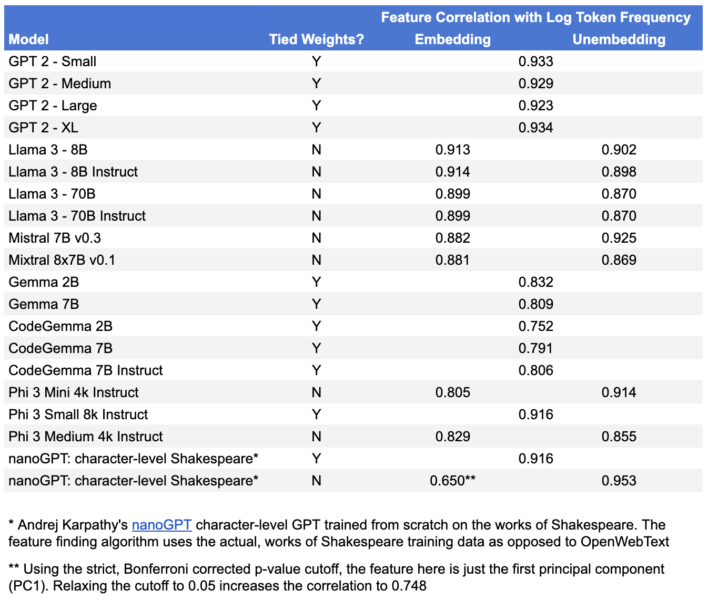
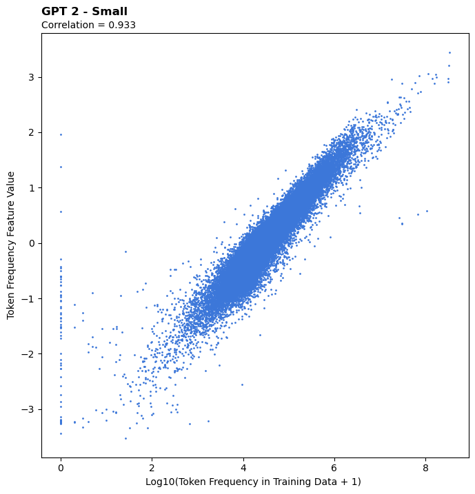
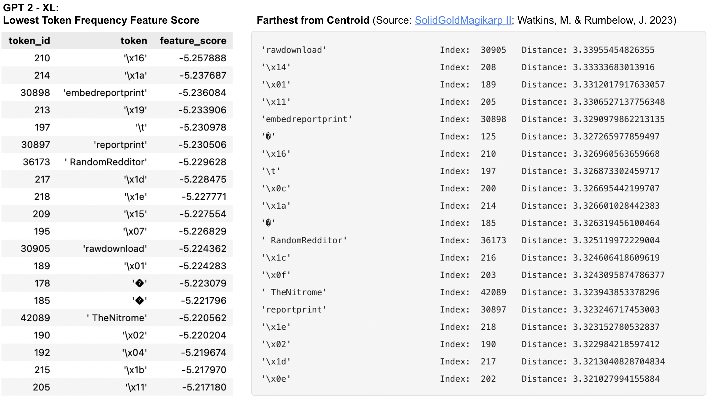
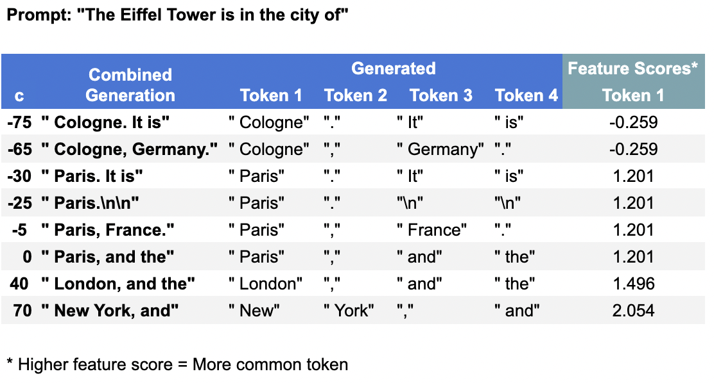

# LLMs Universally Learn a Feature Representing Token Frequency / Rarity

## Summary

 - LLMs appear to _universally_ learn a feature in their embeddings representing the frequency / rarity of the tokens they were trained on
 - This feature is observed across model sizes, in base models, instruction tuned models, regular text models, and code models
 - In models without tied weights, this feature is present in both models' embedding and unembedding matrices
 - This feature can be used to find "glitch tokens" (e.g. [SolidGoldMagikarp](https://www.alignmentforum.org/posts/aPeJE8bSo6rAFoLqg/solidgoldmagikarp-plus-prompt-generation))
 - In limited experiments using this feature for activation steering, the model pays relatively little attention to this feature. As such, it's likely not a strong target for activation steering efforts

## Definitions / Notation

I use [Olah et al.'s](https://distill.pub/2020/circuits/zoom-in/#claim-1) definition of a **feature** as a direction in the vector space of a model's weights / activations in a given layer.

**[Tied weights](https://paperswithcode.com/method/weight-tying)** are a common LLM architectural choice where in order to reduce the number of parameters in the model and align the embeddings and unembeddings, the same weights matrix is used for both. Of the models discussed here the GPT 2 series, Gemma series, and Phi 3 Small models use tied weights. All others have separate weight matrices for their embeddings and unembeddings. For brevity, in models _with_ tied weights, I will refer to both the embeddings and unembeddings as simply the model's **"embeddings"** since the two are identical.

**Linear probing** is just a fancy name for using linear regression (or classification) on the internal representations (weights or activations) of models.

## How to Find the Feature

 1. Ideally, get access to the model's training data
    - When this is not possible (i.e. for basically all well known open source LLMs), I use the [OpenWebText dataset](https://skylion007.github.io/OpenWebTextCorpus/) as a rough proxy
 2. Load the model's tokenizer
 3. Tokenize the dataset and count the frequency of each token in the tokenizer's vocabulary. The end result should be a vector of length $V$ (the size of the vocabulary) with the counts ordered by token ID
 4. (Optional) Because steps 1-3 can be slow, save the resulting counts somewhere for future use
    - Saved counts for all the models I studied can be found [here](token_counts/)
 5. Load the embedding to be analyzed. This should be a matrix of size $V \times D$ where $D$ is the dimensionality of the embedding
    - Note: It may be necessary to transpose the matrix if it's an unembedding and is of shape $D \times V$
 6. Calculate all $D$ [principal components](https://en.wikipedia.org/wiki/Principal_component_analysis) of the embedding matrix
 7. Using the principal components, project the matrix into its principal component form. We'll call this resulting matrix the `PC_matrix`. It will also be of size $V \times D$
    - Note: We're not doing any dimensionality reduction, just rotating the axes
 8. Run a linear probe on each column of the `PC_matrix` separately, regressing the principal component values vs. $\log_{10}(\text{token\\_count} + 1)$ for each token. While performing each regression, evaluate the p-value of that principal component and keep a list of all principal components with a p-value $\leq \frac{0.05}{D}$
    - Note: $\frac{0.05}{D}$ = the standard 0.05 statistical significance cutoff after applying a [Bonferroni correction](https://en.wikipedia.org/wiki/Bonferroni_correction) to account for the sheer number of linear probes run
    - If p-value $\leq \frac{0.05}{D}$ is too strict, you may consider relaxing this cutoff, but this cutoff generally works well  
 9.  Run one final linear probe now using all the principal components kept during step 8 vs. $\log_{10}(\text{token\\_count} + 1)$ and save the final regression weights for each
 10. Finally, to get the actual feature vector, you can simply calculate a weighted sum of the principal components using the weights from step 9 and (optionally) normalize

Code for this process can be found [here](https://github.com/sosier/LLM_Token_Frequency_Feature/blob/main/find_feature.py#L191), and the final feature vectors for all the models I studied can be found [here](feature_vectors/).

## Results

I was able to find the feature in 20 different models: 18 popular open source LLMs and their variants plus two smaller, GPT-style models trained on a fully known training dataset for validation. This includes a variety of different model sizes (from 10M to 70B parameters), both base models and instruction tuned models, and even code models. The results are summarized in the table below:

You'll notice the feature correlates very strongly with the log token frequency (typically ~0.9). To visualize this, here's a scatter plot for one specific model (GPT 2 - Small). (Scatter plots for all other models, plus code to replicate the results can be found [here](Find_Token_Frequency_Feature.ipynb).)

Interestingly, we see high correlations for both model embeddings and unembeddings.  In some cases, we even observe that the embedding correlation is stronger than the unembedding correlation, despite initially expecting the feature to be stronger in unembeddings.

The weakest correlations were observed for the CodeGemma models. My hypothesis for this is that, being code models, the data they were trained on differs more substantially from our proxy dataset (OpenWebText) than it did for the other, more standard text models. I believe this is also the case for the regular Gemma models to a lesser extent, due to more of their training data being non-English text. (OpenWebText filters out non-English webpages.)

All that said, the only way to truly confirm the feature measures training data token frequency is to use a model's actual training data instead of a proxy. As such, I trained two small character-level language models on the works of Shakespeare using Andrej Karpathy's [nanoGPT repo](https://github.com/karpathy/nanoGPT/tree/master). I trained one version with tied weights (in true GPT fashion) and one without. This experiment yielded this single highest correlation observed across the models investigated, generally confirming that yes, the feature actually measures training data token frequency.

## Possible Uses

I also explored a couple possible uses for this feature, beyond improving model understanding alone.

### Identifying Glitch Tokens

One use for this feature is as a way to identify candidate "glitch tokens" a la the infamous [SolidGoldMagikarp](https://www.alignmentforum.org/posts/aPeJE8bSo6rAFoLqg/solidgoldmagikarp-plus-prompt-generation) token. Indeed, one leading hypothesis for the existence of these tokens is that they're tokens that appear in a model's tokenizer but never (or only very rarely) appear in the model's actual training data. As such, this is an extremely natural use for this feature.

While I haven't fully investigated this, initial inspection suggests the tokens scored as least frequent by the feature align well with the list of anomalous tokens shared in [SolidGoldMagikarp II: technical details and more recent findings](https://www.alignmentforum.org/posts/Ya9LzwEbfaAMY8ABo/solidgoldmagikarp-ii-technical-details-and-more-recent).

### Activation Steering

I also performed some initial exploration on how this feature could potentially be used to influence model behavior through _activation steering_. I did this by simply adding the feature vector times some chosen constant $c$ to the final hidden state of the model before the unembedding matrix is applied. Note, due to computational / time constraints, this investigation was conducted on GPT 2 - Small only, and so the findings may or may not generalize to the other models.

One important observation from this exercise was that it required very large / small steering vectors (i.e. very large / small values of $c$) to change model outputs. Indeed, at its most extreme it typically required $|c| > 1000$ to push models outputs to the extremes of the feature: always outputting the most or least frequent token according to the feature. With other, unrelated features this can typically be done with much lower values $c$, e.g. $|c| > 100$ or even less. This suggests the model pays relatively little attention to this feature. Ultimately, because of this, **I don't believe it's a strong target for activation steering efforts.**

Nevertheless, the activation steering did have the effect you might anticipate of pushing the model to use more common / rare tokens. This is demonstrated in the activation steering example pictured below where you can see we push the model toward more rare first tokens with negative values of $c$ and toward more common with higher values of of $c$. 

## Final Thoughts / Next Steps

Obviously, this is not a _surprising_ feature. It definitely seems like a feature models _should_ learn. As such, I hope that this work:

 1. Was able to demonstrate not just that models _should_ learn this feature, but that they _universally_ do in practice, in real large-scale models
 2. Enables others to quickly find this feature in new models
 3. Encourages others to try to demonstrate the universality of features they find (or at least some of the most important ones!)

Given this, a natural next project, building off this one, would be to try to demonstrate the universality of a "feature" for token bigram statistics. The theory from [A Mathematical Framework for Transformer Circuits](https://transformer-circuits.pub/2021/framework/index.html#zero-layer-transformers) suggests this should be related to the product of embedding and unembedding matrices, but to my knowledge this hasn't yet been empirically demonstrated as universal in LLMs.

In fact, if the bigram statistic theory is correct and universal, that could explain why GPT 2 - Small was relatively insensitive to my attempts to steer it using the token frequency feature. Specifically, my current hypothesis is that the feature is important to the model not for providing some sort of baseline prior on the output tokens, but rather as a feature the model uses to learn / store bigram statistics (which ultimately become a better prior it can use / update).

## Acknowledgements

I have to express my gratitude to all the companies who made their models open source (OpenAI, Meta, Mistral, Google, and Microsoft). This work would have been impossible otherwise as I definitely don't have the means to train any of these models myself! I also want to thank Hugging Face for hosting the models and providing helpful code for pulling / interacting with them, and of course Andrej Karpathy for building and sharing his [nanoGPT repo](https://github.com/karpathy/nanoGPT/tree/master).
